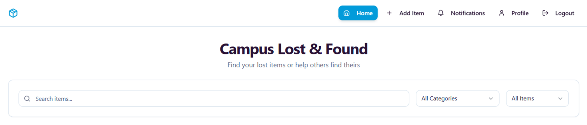

# \# Lost \& Found Portal

# 

# A web-based Lost \& Found Portal developed for college campuses to help students report, search, and recover lost items efficiently.

# 

# \## Features

# 

# \* User Authentication

# \* Add Lost/Found Items

# \* Image Upload

# \* Search \& Filter Items

# \* Secure Claim Verification

# \* Responsive UI

# 

# \## Tech Stack

# 

# \* React.js

# \* TypeScript

# \* Tailwind CSS

# \* Supabase

# \* Netlify

# 

# \## Learning Outcomes

# 

# \* Frontend Development

# \* Database Handling

# \* Authentication Systems

# \* Deployment using Netlify

# \* Responsive UI Design

# 

# \## Future Improvements

# 

# \* AI-based item matching

# \* QR code support

# \* Notification system

# ## Screenshots

### Register Page

### Dashboard

### Profile Page

